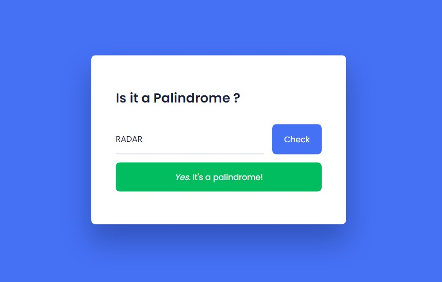

# Palindrome checker 
- This project is String palindrome checker : Words
- A simple and well designed palindrome checker is made using Javascript and decorated with HTML and CSS.
- This is a beginner level project to check your js skills.
- This project is made with the skills I have learn't during my course.
- Enter a word and check whether its a palindrome or not Eg: Madam - madam, Hello - olleh

### Result of Palindrome_Checker Img
